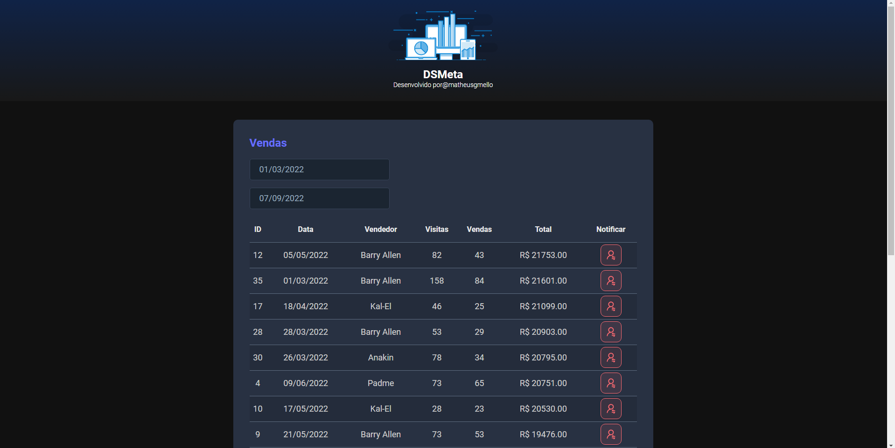

# Dsmeta

Sistema de Registro de Vendas que permite consulta e pesquisa em uma tabela de dados de vendedores, além de enviar um SMS ao vendedor destaque do mês usando o Twilio SMS.

# Configurações 

### (API)
- Clone o repositório
- Entre na pasta (`cd backend`)
- Configure o arquivo `aplication.properties` colocando a chaves do(`twilio SMS`)
- Rode a aplicação (`./mvnw spring-boot:run`)

### (Web)
  - Entre na pasta (`cd frontend`)
  - Instalar dependências (`yarn install`)
  - Rode a aplicação (`yarn run dev`)

# Resposta da API

# Tecnologias 

- [Java 17](https://docs.oracle.com/en/java/javase/17/)
- [Spring](https://spring.io/)
- [Twilio API](https://www.twilio.com/docs/usage/api)
- [React](https://react.dev/)
- [Axios](https://axios-http.com/)

<!--START_SECTION:footer-->
 

## 🔗 Connect with me

<!--END_SECTION:footer-->

